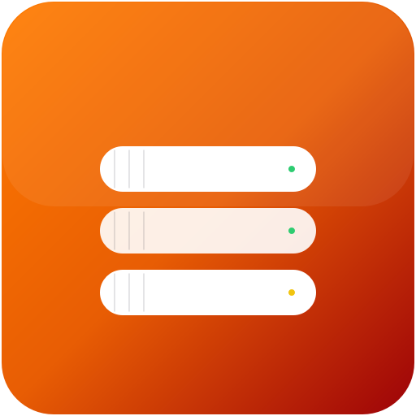
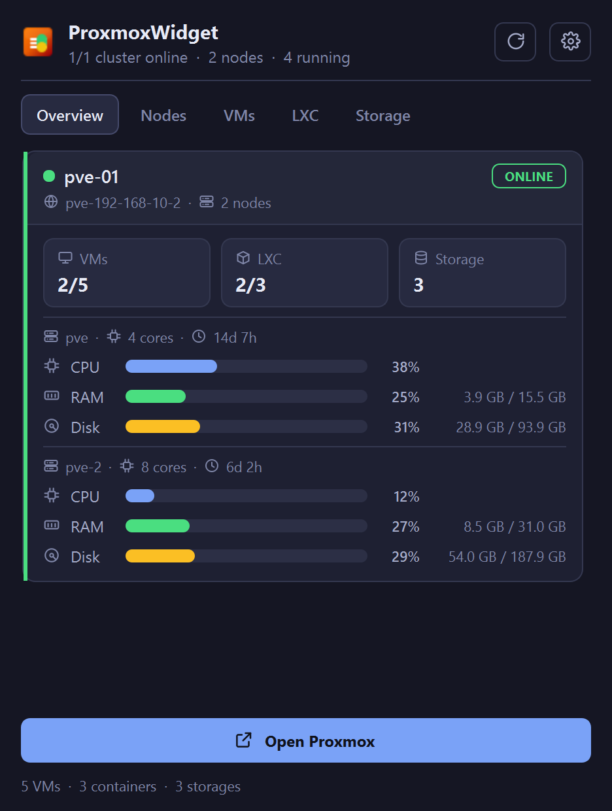
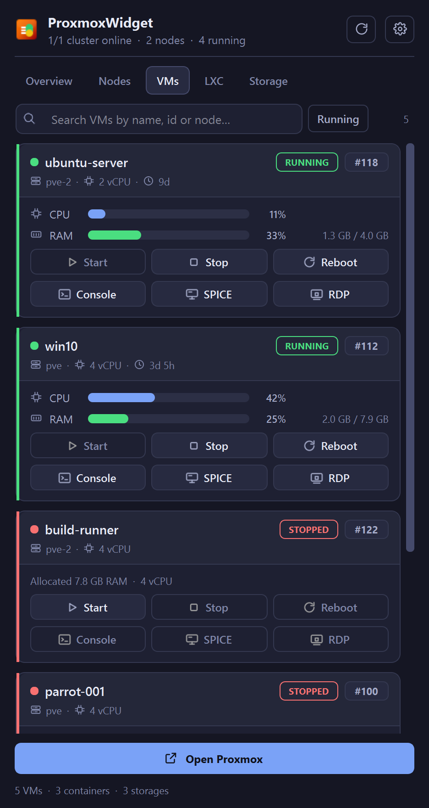
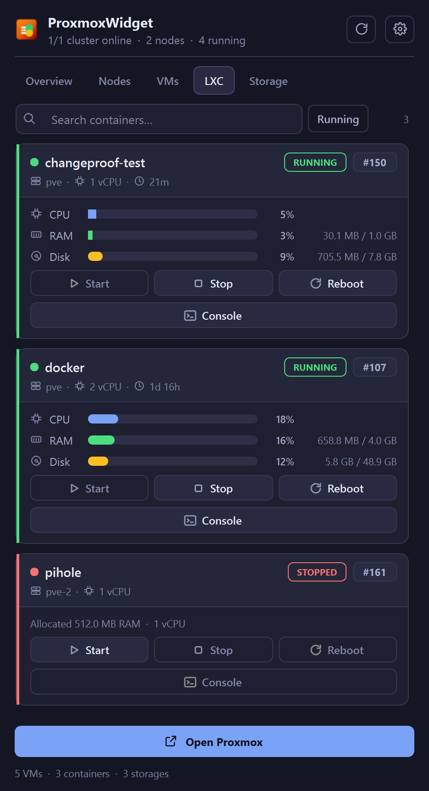
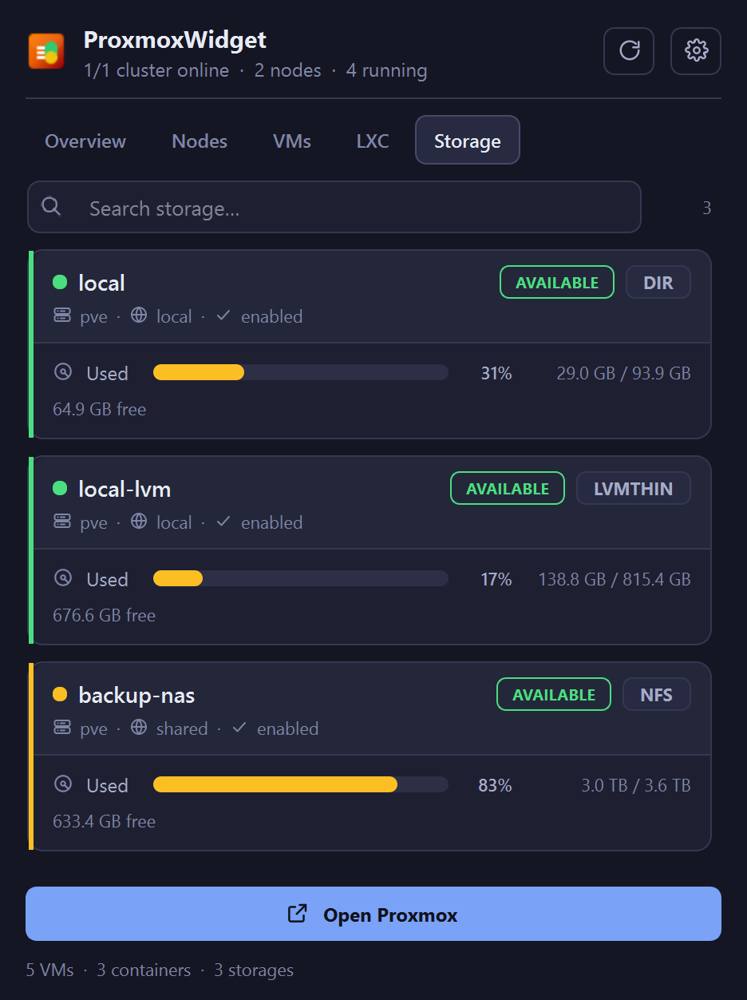
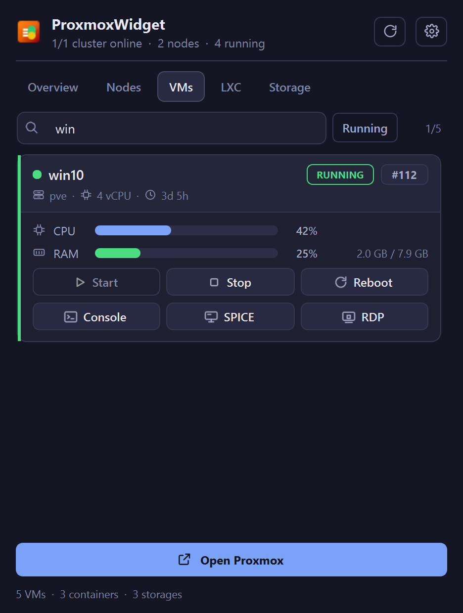
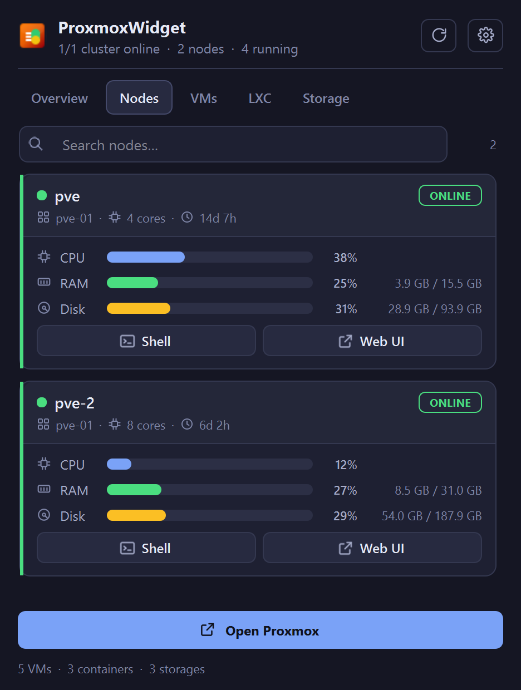
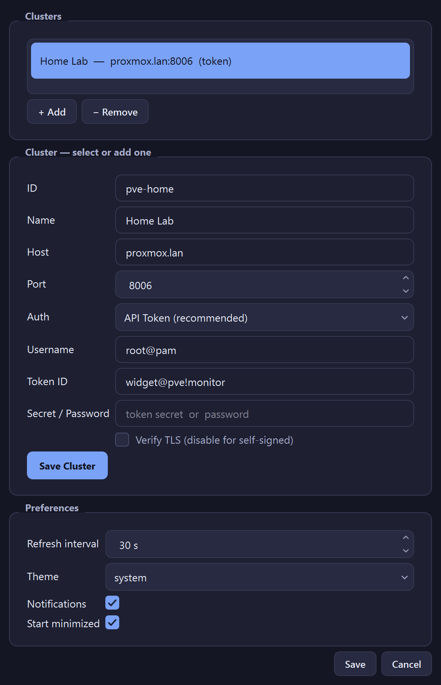

<p align="center">
  
</p>

<h1 align="center">ProxmoxWidget - Proxmox VE Desktop Client (Tray)</h1>

<p align="center">
  <a href="https://github.com/PhantomPixelDev/proxmox-monitor/releases"></a>
  <a href="https://github.com/PhantomPixelDev/proxmox-monitor/actions/workflows/ci.yml?branch=master"></a>
  <a href="LICENSE"></a>
  <a href="pyproject.toml"></a>
  <a href="https://doc.qt.io/qtforpython/"></a>
</p>

<p align="center">
  Live infrastructure at a glance. A lightweight tray app for Proxmox VE that shows nodes, VMs, LXC, and storage without opening the browser.
</p>

<p align="center">
  <a href="#download">Download</a> •
  <a href="#quick-start">Quick Start</a> •
  <a href="#screenshots">Screenshots</a> •
  <a href="#features">Features</a> •
  <a href="#api-token-least-privilege">API Token</a> •
  <a href="#troubleshooting">Troubleshooting</a> •
  <a href="#advanced--developer-install">Advanced</a>
</p>

> Works on Windows, Linux, and macOS. Click the tray icon and you get a live dashboard for every cluster you manage. No browser tab clutter, no polling your phone.

---

## Download

No Python needed. Grab a ready to run build from **[Releases](https://github.com/PhantomPixelDev/proxmox-monitor/releases/latest)**.

- **Windows:** `ProxmoxWidget-*-Windows-x64-Setup.exe` (installer, double-click) and `ProxmoxWidget-*-Windows-x64-Portable.zip` (portable, unzip and run `ProxmoxWidget.exe`)
- **Linux:** `ProxmoxWidget-*-Linux-x64.tar.gz` (extract, then run `ProxmoxWidget`)
- **macOS:** `ProxmoxWidget-*-macOS-x64.dmg` (drag to Applications) and `ProxmoxWidget-*-macOS-x64.tar.gz` (fallback)
- **Checksums:** `SHA256SUMS.txt` in every release for verification

Versioned example for `v0.1.3`:

```
https://github.com/PhantomPixelDev/proxmox-monitor/releases/download/v0.1.3/ProxmoxWidget-0.1.3-Windows-x64-Setup.exe
https://github.com/PhantomPixelDev/proxmox-monitor/releases/download/v0.1.3/ProxmoxWidget-0.1.3-Windows-x64-Portable.zip
https://github.com/PhantomPixelDev/proxmox-monitor/releases/download/v0.1.3/ProxmoxWidget-0.1.3-Linux-x64.tar.gz
https://github.com/PhantomPixelDev/proxmox-monitor/releases/download/v0.1.3/ProxmoxWidget-0.1.3-macOS-x64.dmg
https://github.com/PhantomPixelDev/proxmox-monitor/releases/download/v0.1.3/ProxmoxWidget-0.1.3-macOS-x64.tar.gz
https://github.com/PhantomPixelDev/proxmox-monitor/releases/download/v0.1.3/SHA256SUMS.txt
```

Browse all builds at [github.com/PhantomPixelDev/proxmox-monitor/releases](https://github.com/PhantomPixelDev/proxmox-monitor/releases) or jump straight to [latest](https://github.com/PhantomPixelDev/proxmox-monitor/releases/latest).

> Verify with `SHA256SUMS.txt`. Each file has a matching `.sha256` as well.

---

## Quick Start

1. Download from [Releases](https://github.com/PhantomPixelDev/proxmox-monitor/releases/latest) and double-click `ProxmoxWidget-*-Windows-x64-Setup.exe` (or unzip `ProxmoxWidget-*-Windows-x64-Portable.zip` and run `ProxmoxWidget.exe`). On Linux extract the `tar.gz`, on macOS open the `dmg`.
2. Find the tray icon (Windows: check hidden icons overflow, macOS: menu bar). Right-click and pick Settings, or click the gear icon.
3. Add Cluster, enter host `your.host.example`, port `8006`, and paste token `widget@pve!monitor` (full form `PVEAPIToken=widget@pve!monitor=your-secret`, see API Token below). Save, done. Dashboard polls right away and the footer shows `online/clusters, nodes, VMs, containers`.

> Example only. Replace `your.host.example` with your real host.

Need logs? Run with `--dev`:

```bash
ProxmoxWidget.exe --dev
# Linux/macOS after extract
./ProxmoxWidget --dev
```

First launch puts an icon in your tray. If you don't see it, check overflow or the menu bar.

---

## Screenshots

<p align="center"></p>

<p align="center"><sub>Overview — the whole cluster in one popup</sub></p>

| VMs | Containers | Storage |
| --- | --- | --- |
|  |  |  |
| Start, stop, reboot, and Console, SPICE or RDP per card | Same card layout for LXC, disk usage included | Warning rail once a store passes 75% |

| Search | Nodes | Settings |
| --- | --- | --- |
|  |  |  |
| Filter by name, VMID, node or status | Node metrics plus a shell shortcut | One form per cluster, secrets go to the keyring |

Regenerate them with `python scripts/capture_screenshots.py --mock`.

---

## Features

| Icon | Feature | What you get |
| --- | --- | --- |
| 🏢 | Multi-cluster | Add many `host:port` endpoints, switch between them, totals roll up in the header |
| 🔐 | Least-privilege API tokens | Uses `PVEAPIToken=...`, never your root password. Works with `PVEAuditor` plus `VM.Audit` and optional `VM.PowerMgmt` |
| ⏳ | Live wait state | Start, Stop, Reboot show a busy badge and bar, polling waits until the guest reaches the wanted state |
| 🔴 | Offline badge | Clusters that fail to respond show OFFLINE with the error, no spinner forever. Offline nodes get a red dot |
| 🌓 | Dark, Light, System | QSS themes that follow your OS. No restart needed |
| 🔑 | OS keyring | Tokens go to the system keyring, not a plain file. Config stays in `platformdirs` |
| 🔔 | In-app banner, not popup spam | Messages use a banner inside the dashboard. The app runs with `pythonw` on Windows so there is no console |
| 🔄 | Auto-refresh | Polls on a timer you control, default 30 seconds, plus a manual Refresh button and tray action |
| 🖥️ | Tray goodness | Badge logic, tooltip with `online/clusters` and `running/VMs`, left-click popup, right-click menu with Open Proxmox per cluster |
| 📊 | Tabs that make sense | Overview, Nodes, VMs, LXC, Storage. Each tab scrolls so it stays usable on small screens |
| 🔎 | Search on every list tab | Filter by name, VMID, node or status as you type, plus a Running toggle on the guest tabs and a shown/total counter |
| 🖥️ | Console in one click | noVNC for any guest, SPICE handed to `remote-viewer` as a `.vv` file, and RDP straight to the IPv4 address the QEMU guest agent reports |
| ⌨️ | Node shell | Opens the node's noVNC shell without hunting through the web UI |
| 🎨 | Cards you can read | Each guest is its own card with a status-coloured rail, a header block and aligned metric rows, so rows never blur together |
| 🌐 | One-click open | Open Proxmox button and tray Open menu jump to `https://your.host.example:8006` for the active cluster |
| 🧱 | Storage aware | Shows type, shared or local, enabled or disabled, and a use bar with `used / total` and free space |

---

## API Token, Least Privilege

You don't need a full admin user. Create a token that can read and, if you want, manage power.

### Step 1 - Create the token in Proxmox VE

1. Log in to Proxmox VE as `root@pam` or another admin.
2. Go to **Datacenter > Access > API Tokens > Add**.
3. Pick a user, for example `widget@pve`. If it doesn't exist, create it under **Access > Users** first.
4. Set token ID to `monitor`, so the full ID is `widget@pve!monitor`.
5. Uncheck **Privilege Separation** if you want the token to inherit the user permissions directly. Leave it checked if you plan to set permissions on the token itself.
6. Click Add, then **copy the secret once**. It looks like `xxxxxxxx-xxxx-xxxx-xxxx-xxxxxxxxxxxx`. You won't see it again.

### Step 2 - Give it the right permissions

Go to **Datacenter > Permissions > Add** and give the user or token at least:

- `PVEAuditor` on `/` for cluster and node read
- `VM.Audit` on `/` for VM and LXC read
- `VM.PowerMgmt` on `/` only if you want Start, Stop, Reboot from the widget. Skip this for read only mode.

If you skip `VM.PowerMgmt`, the widget still works. Buttons will just return a 403 with a banner error.

### Step 3 - Paste it in the app

Open ProxmoxWidget, go to Settings, Add Cluster, and paste as:

```
PVEAPIToken=widget@pve!monitor=xxxxxxxx-xxxx-xxxx-xxxx-xxxxxxxxxxxx
```

The app builds the `Authorization` header for you and never logs the secret.

### Why least privilege matters

Tokens are long lived. If a laptop is lost or a token leaks in a screenshot, a narrow token limits harm. OS keyring storage helps, but a small scope is your real safety net. If you share a screenshot, blur the token and the host.

---

## Security

- No password auth. Only API tokens.
- Tokens go to the OS keyring via `keyring`. On Windows that is Credential Manager, on macOS Keychain, on Linux Secret Service or KWallet.
- Config with non-secret fields lives in the platform config dir via `platformdirs`. Check it with `python -m proxmox_widget --help` or look in `%APPDATA%/proxmox-widget` on Windows.
- TLS verify is on by default for `httpx`. If you use self signed certs on your homelab, set verify per cluster in Settings. Prefer adding your CA to the system store instead of turning verify off.
- No console on Windows unless you pass `--dev`. Logs go to the log file in the platform log dir, not to stdout.
- Notifications are an in-app banner, not OS popups that might leak names on a shared screen.

---

## Troubleshooting

| Symptom | Likely cause | Fix |
| --- | --- | --- |
| `OFFLINE` badge right after Add Cluster | Host, port, or token wrong. Or host unreachable | Check the banner error. Confirm `https://your.host.example:8006` loads in a browser. Re paste the token without extra spaces |
| `500` on refresh, then recovers | Proxmox API hiccup or node restart | The widget retries on next poll. If it stays, check `pveproxy` logs on the node with `journalctl -u pveproxy` |
| `Connection reset` or `ConnectError` | Network blip, firewall, or TLS intercept | Try `curl -vk https://your.host.example:8006/api2/json/version -H "Authorization: PVEAPIToken=..."`. Check VPN and corporate proxy |
| `403 Forbidden` on Start or Stop | Token lacks `VM.PowerMgmt` | Add that privilege on `/` or on the specific VM pool. Then Save in Settings again |
| `401 Unauthorized` | Token ID or secret wrong, or Privilege Separation mismatch | Copy again. Make sure the token ID is exactly `widget@pve!monitor` and the header is `PVEAPIToken=...` |
| Dashboard shows `No clusters` after restart | Config dir cleared or different user | Check that you run as the same OS user that saved the settings. Look in the config dir path shown in `--dev` logs |
| Tray icon missing on Windows | Icon in overflow or app still starting | Open the hidden icons chevron, drag ProxmoxWidget out. With `pythonw` there is no console to show startup errors, so run once with `--dev` if it still hides |
| High CPU | Poll interval too low or many clusters | Bump the interval to 30 or 60 seconds in Settings |
| Self signed cert error | `CERTIFICATE_VERIFY_FAILED` | Add your CA to the OS store, or toggle verify off for that cluster in Settings as a last resort |

Still stuck? Run `python -m proxmox_widget --dev` and copy the log lines that mention the cluster ID, not the token.

---

## Dev

For contributors. Users can stop at Quick Start.

```bash
# setup
uv venv && uv pip install -e ".[dev]"

# lint and types
ruff check src tests
ruff format src tests
basedpyright src

# tests
pytest
pytest --cov=proxmox_widget --cov-report=term-missing

# run the app in dev mode with console and verbose logs
python -m proxmox_widget --dev
# or
uv run proxmox-widget --dev
```

Project layout:

```
src/proxmox_widget/
  __main__.py        # entry, pythonw handling, --dev flag
  config/models.py   # cluster, health, storage models
  resources/app.png  # source icon, hero and screenshots
  resources/app.ico  # Windows icon, used by Nuitka
  resources/icons.py # make_app_icon, make_tray_icon
  api/client.py      # PVE REST calls, console URLs, spiceproxy, guest agent
  core/launcher.py   # opens noVNC, remote-viewer and the platform RDP client
  ui/dashboard.py    # popup dashboard, tabs, search, cards, banners
  ui/icons.py        # inline SVG icon set rendered to HiDPI pixmaps
  ui/themes.py       # dark and light palettes plus the QSS built from them
  ui/tray.py         # tray menu, tooltip, left-click vs right-click
```

---

## Packaging

This repo builds standalone with Nuitka. No PyInstaller. User builds are not required, use the build from Releases.

```bash
# Windows standalone (CI packages to Portable ZIP + Setup.exe via Inno Setup)
python -m nuitka --standalone --enable-plugin=pyside6 --windows-console-mode=disable --windows-icon-from-ico=src/proxmox_widget/resources/app.ico --include-data-dir=src/proxmox_widget/resources=resources --output-dir=dist src/proxmox_widget/__main__.py

# Linux standalone then tar.gz
python -m nuitka --standalone --enable-plugin=pyside6 --output-dir=dist src/proxmox_widget/__main__.py

# macOS app bundle
python -m nuitka --standalone --enable-plugin=pyside6 --macos-create-app-bundle --macos-app-icon=src/proxmox_widget/resources/app.png --output-dir=dist src/proxmox_widget/__main__.py
```

Local helpers that mirror CI flags:

```powershell
# Windows
powershell -ExecutionPolicy Bypass -File scripts/build-nuitka.ps1
# Linux / macOS
bash scripts/build-nuitka.sh
# optional: bash scripts/build-nuitka.sh --clean
```

Notes:

- `--windows-console-mode=disable` is the `pythonw` behavior for the built exe. Use `--dev` at runtime if you need a console.
- Keep `app.ico` with 256, 128, 64, 48, 32, 16 sizes so the exe shows crisp at every scale.
- CI runs `ruff check`, `basedpyright src`, `pytest -q` on Python 3.11 and 3.12 via `.github/workflows/ci.yml`; releases are built by `.github/workflows/release.yml` (tag `v*` triggers Nuitka matrix + `softprops/action-gh-release` with `SHA256SUMS.txt`).

---

## Roadmap

- [x] Real screenshots, regenerated from the app by `scripts/capture_screenshots.py`
- [ ] Per-VM sparkline for CPU over last 10 polls
- [ ] Notifications opt in for node down and VM crash, still via in-app banner plus optional OS notify
- [x] Search and filter on every list tab
- [ ] Light-theme screenshots alongside the dark set
- [ ] Bulk actions for a whole node
- [ ] Import and export clusters as JSON
- [ ] Auto updater check against GitHub releases

Have an idea? Open an issue with the label `enhancement` and a short screencast.

---

## FAQ

**Is ProxmoxWidget an official Proxmox project?**
No. It is a community tray client that talks to the Proxmox VE API. Proxmox and PVE are trademarks of Proxmox Server Solutions GmbH.

**Does it work on macOS and Linux?**
Yes. The tray uses PySide6 Qt. On macOS it lives in the menu bar. On Linux it needs a system tray like on KDE or GNOME with AppIndicator.

**What permissions does the API token need?**
Read only needs `PVEAuditor` and `VM.Audit` on `/`. Add `VM.PowerMgmt` only if you want Start, Stop, Reboot from the widget.

**Why do I not see a console on Windows?**
The app ships to run with `pythonw`, so no console pops. Run `python -m proxmox_widget --dev` or `ProxmoxWidget.exe --dev` to get logs.

**Why does an action stay on `WAIT` for a while?**
The widget polls after Start, Stop, or Reboot until the guest reaches the target status. Slow storage or a stuck guest can take a minute. The busy badge clears when the poll matches.

**How is this different from opening Proxmox in a browser?**
It is faster for quick checks. One click shows health, resource bars, and controls for all clusters. Use Open Proxmox when you need the full UI.

**Where are settings stored?**
In the platform config dir via `platformdirs` and secrets in the OS keyring. Uninstalling the pip package does not delete config. Remove the config dir by hand if you want a clean slate.

---

## Advanced / Developer Install

For Python users or contributors. Normal users should use Download above.

```bash
# from source, isolated
pipx install git+https://github.com/PhantomPixelDev/proxmox-monitor.git
proxmox-widget

# or local clone
git clone https://github.com/PhantomPixelDev/proxmox-monitor.git
cd proxmox-monitor
pipx install .

# no console on Windows
pythonw -m proxmox_widget

# console for logs
python -m proxmox_widget --dev
```

Update later:

```bash
pipx upgrade proxmox-widget
# or reinstall from source
pipx install --force git+https://github.com/PhantomPixelDev/proxmox-monitor.git
```

---

## Keywords and SEO

`proxmox`, `pve`, `pve-monitoring`, `proxmox-ve`, `proxmox-widget`, `system-tray`, `tray-app`, `pyside6`, `qt6`, `homelab`, `desktop-client`, `api-token`, `least-privilege`, `vm-management`, `lxc`, `storage-monitoring`, `python-3.11`, `nuitka`, `windows-tray`, `macos-menu-bar`, `linux-tray`

If you host a homelab blog, link to this repo with the phrase `Proxmox VE desktop client for the system tray` and it helps others find it.

---

## License

MIT. See [LICENSE](LICENSE) if present, else `pyproject.toml` license field.

Logo and icons are part of the repo under the same license unless noted. The Proxmox name is not included in the license.

---

<p align="center">
  <sub>Built for homelabs that like their infra live and their tokens least-priv. If it saves you a tab, star it.</sub>
</p>
